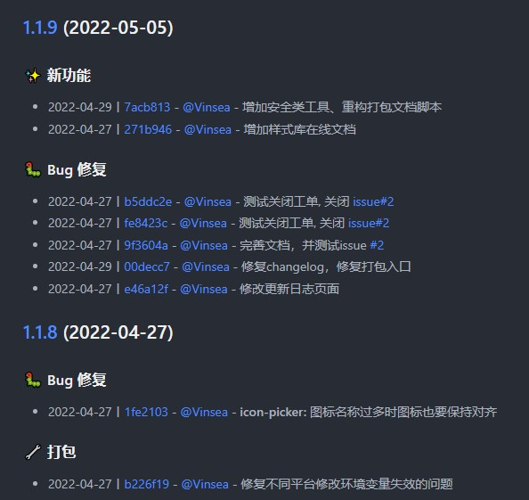

[](https://www.npmjs.com/package/@vinsea/conventional-changelog-angular
)

# @vinsea/conventional-changelog-angular

> [conventional-changelog](https://github.com/ajoslin/conventional-changelog) [angular](https://github.com/angular/angular) preset

this preset is an clone of [conventional-changelog-angular](https://www.npmjs.com/package/conventional-changelog-angular), with some modifications & additions.

## examples
[CHANGELOG.md](../../CHANGELOG.md)



## Usage
```
npm i @vinsea/conventional-changelog-angular -D
```
```json
{
  "scripts": {
    "changelog": "conventional-changelog -p @vinsea/angular -i CHANGELOG.md -s"
  }
}
```
If this is your first time using this tool and you want to generate all previous changelogs, you could do
```json
{
  "scripts": {
    "changelog": "conventional-changelog -p @vinsea/angular -i CHANGELOG.md -s -r 0"
  }
}
```
With npm version
```json
{
  "scripts": {
   "version": "conventional-changelog -p @vinsea/angular -i CHANGELOG.md -s && git add CHANGELOG.md"
  }
}
```
Refer [conventional-changelog-cli](https://www.npmjs.com/package/conventional-changelog-cli) for more details

## Angular Convention

Angular's [commit message guidelines](https://github.com/angular/angular/blob/master/CONTRIBUTING.md#commit).

[see more details](https://github.com/conventional-changelog/conventional-changelog/blob/master/packages/conventional-changelog-angular/README.md)